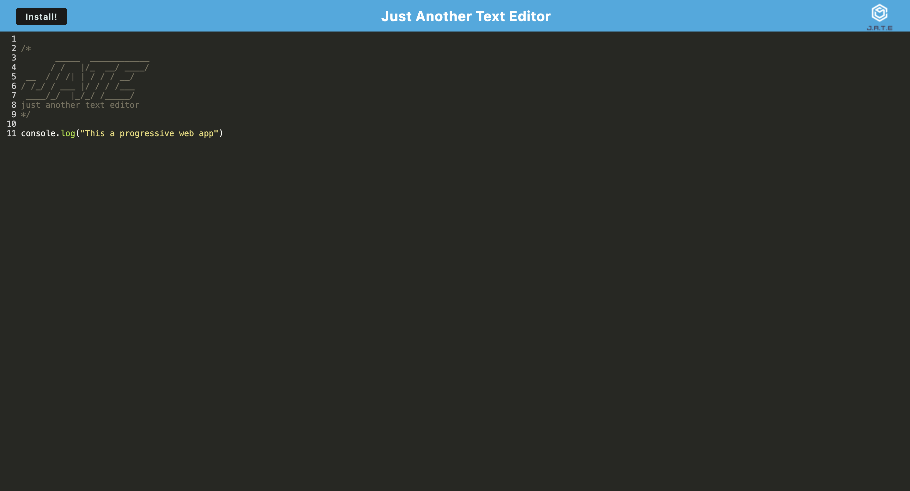

# text-editor-pwa

## Description 
This project utilizes the programming languages of html, css, and javascript as well as tools like express, and bundlers such as webpack to create and display a text editor that functions as a progressive web application. This project consisted of creating and assigning databases and ensuring that everything is properly connected to the api through proper routing to the server. 

## Usage

## Credits 
Sought out assistance from the websites and resources listed below: 
- [x] Referenced the tutorial for this week
- [x] Akon - TA

## License 
MIT